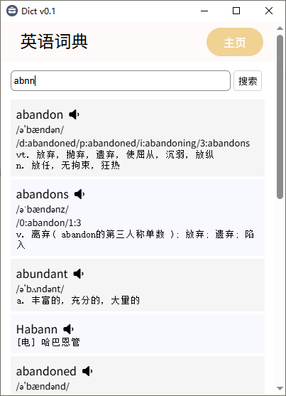
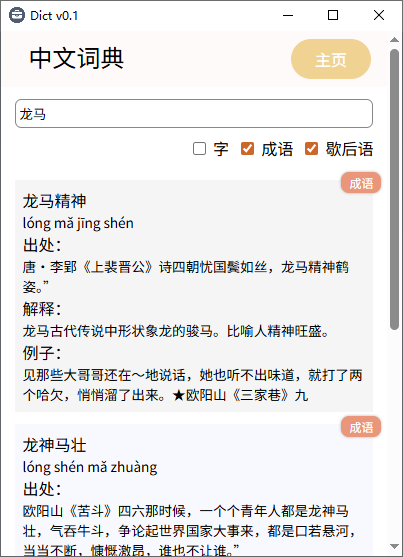
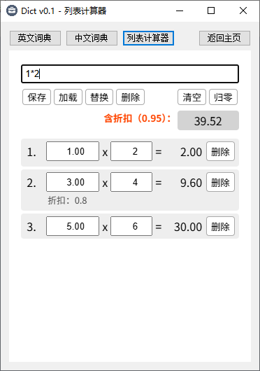

Dict 是一个免费无广、绿色的词典软件。自带英文、中文字、成语、歇后语词库，本地使用不需要网络。

这是 windows 版，系统需要 .net framework 4.8 运行时。还有个安卓同款软件 [toolsbox](http://github.com/jjling2011/toolsbox)。

#### 截图

  

#### 下载地址

[latest release](https://github.com/jjling2011/dict/releases/latest)

#### 开发

使用 Visual Studio 编译后，下载 [dictdb.zip](https://github.com/jjling2011/dict/releases/download/dictdb/dictdb.zip)，把里面的 dict.db 解压到 `bin\Debug\dictdb\` 目录内。

#### 感谢

中文词典数据来源：  
https://github.com/pwxcoo/chinese-xinhua

英语词典数据来源：  
https://github.com/1eez/103976  
https://github.com/KyleBing/english-vocabulary  
https://github.com/skywind3000/ECDICT
